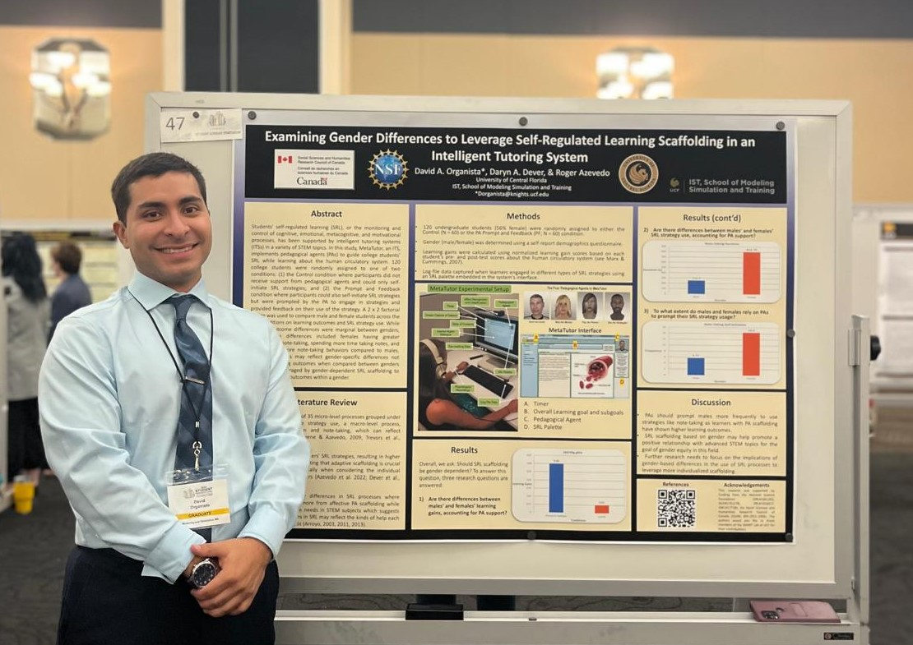

# Modeling and Simulation Portfolio
## Academic and professional Projects from Fall 2022 until Spring 2024

## Two-Year Summary

Over the past two years, I've been deeply engaged in the world of modeling and simulation through my work at the SMART Lab and my commitment to volunteer activities. During this time, my focus has been on enhancing AI-human interactions, particularly in the domain of intelligent tutoring systems.

### SMART Lab Experience
At the SMART Lab, I contributed to several projects aimed at improving user interaction with AI systems. My role involved extensive data analysis, simulation of user interactions, and the development of models that predict and enhance learning outcomes. This hands-on experience not only sharpened my technical skills but also provided me with invaluable insights into the complexities of human-AI collaboration.

### Volunteering and Leadership
Beyond the lab, I dedicated my time to volunteering with organizations that promote science and technology education. My efforts were geared towards inspiring young students to explore and embrace technology, particularly artificial intelligence, as a tool for problem-solving and innovation.

### Research Contributions
My research during this period led to significant contributions to the field, particularly in intelligent tutoring systems. I authored and co-authored several papers that were accepted at prestigious conferences:

- "Investigating Pedagogical Agents’ Scaffolding of Self-regulated Learning in Relation to Learners’ Subgoals" accepted at the [International Conference of Artificial Intelligence in Education (AIED)](./Papers_and_Presentations/AIED.docx)Tokyo, Japan.
- "Gender Differences in Self-Regulated Learning Strategy Use in an Intelligent Tutoring System" presented at the [European Association for Research on Learning and Instruction (EARLI)] Macedonia, Greece. (./Papers_and_Presentations/EARLI.docx) 
- "Examining Gender Differences in Self-Regulated Learning with MetaTutor " presented at the [American Educational Research Association (AERA)] Chicago, USA.(./Papers_and_Presentations/AERA.docx)
Each of these papers underscored the potential of AI to transform educational methodologies through adaptive learning environments and data-driven insights.

I have also contributed to the making and presentation of research posters including:

- "Examining Gender Differences to Leverage Self-Regulated Learning Scaffolding in an Intelligent Tutoring System."

 . UCF, Orlando, Florida. 

[Full poster here](Images/Poster.png)

This period has been instrumental in shaping my understanding and expertise in AI-driven educational tools, setting a solid foundation for my ongoing contributions to the field of modeling and simulation.
