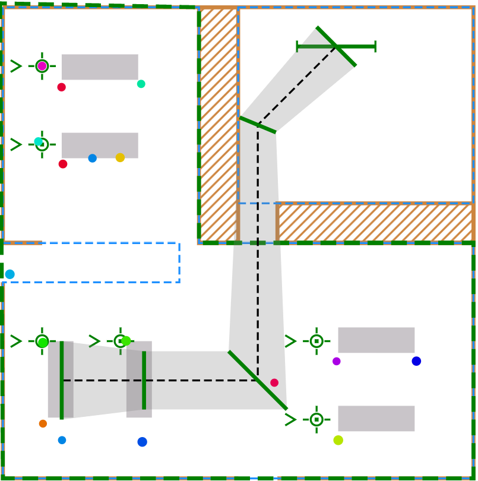

# Modeling and Simulation Portfolio
## Academic and professional Projects from Fall 2022 until Spring 2024

## Two-Year Summary

Over the past two years, I've been deeply engaged in the world of modeling and simulation through my work at the Study of Metacognition and Advanced leaRning Technologies (SMART) Lab and my commitment to volunteer activities. During this time, my focus has been on enhancing AI-human interactions, particularly in the domain of intelligent tutoring systems.

### SMART Lab Experience
At the SMART Lab, I contributed to several projects aimed at improving user interaction with AI systems. My role involved extensive data analysis, simulation of user interactions, and the development of models that predict and enhance learning outcomes. This hands-on experience not only sharpened my technical skills but also provided me with invaluable insights into the complexities of human-AI collaboration.

### Research Contributions
My research during this period led to significant contributions to the field, particularly in intelligent tutoring systems. I authored and co-authored several papers that were accepted at prestigious conferences:

- "Investigating Pedagogical Agents’ Scaffolding of Self-regulated Learning in Relation to Learners’ Subgoals" accepted at the [International Conference of Artificial Intelligence in Education (AIED)](./Papers_and_Presentations/AIED.docx) conference. Tokyo, Japan.

- "Gender Differences in Self-Regulated Learning Strategy Use in an Intelligent Tutoring System" accepted at the [European Association for Research on Learning and Instruction (EARLI)](./Papers_and_Presentations/EARLI.docx) conference. Macedonia, Greece.  

- "Examining Gender Differences in Self-Regulated Learning with MetaTutor " accepted at the [American Educational Research Association (AERA)](./Papers_and_Presentations/AERA.docx) conference. Chicago, USA.

Each of these papers underscored the potential of AI to transform educational methodologies through adaptive learning environments and data-driven insights.

I have also contributed to the making and presentation of research posters including:

- "Examining Gender Differences to Leverage Self-Regulated Learning Scaffolding in an Intelligent Tutoring System." Poster submitted and
accepted to the 2023 UCF Student Scholar Symposium. UCF, Orlando, Florida. 

 

[Full poster here](Images/Poster.png)

This period has been instrumental in shaping my understanding and expertise in AI-driven educational tools, setting a solid foundation for my ongoing contributions to the field of modeling and simulation.

## Volunteering and Leadership
Beyond the lab, I dedicate my time to volunteering with organizations that promote science and technology education. My efforts are particularly focused on inspiring young students to explore and embrace technology, specifically artificial intelligence, as a crucial tool for problem-solving and innovation. As part of my commitment, I actively participated in National Center for Simulation events, representing them at major Modeling & Simulation (M&S) conferences. This included playing a key role in assisting with the annual Interservice/Industry Training, Simulation, and Education Conference (I/ITSEC) for 2022 and 2023, as well as contributing to the Florida Simulation Summit in April 2024. These experiences allowed me to contribute to the field's growth while fostering connections between educational initiatives and the broader simulation community.

## Key Projects

### Project 1: Multimedia Language Acquisition Research

#### Overview
This project leverages a rich array of multimedia tools—including PowerPoint presentations, websites, audio, and video content—to elucidate my research on language acquisition. The goal was to create an accessible and engaging educational resource that highlights the importance and intricacies of how we acquire languages.

#### Details
The multimedia approach was carefully chosen to cater to diverse learning styles, enabling a deeper understanding and retention of the material presented. By integrating dynamic visuals in PowerPoint, interactive elements on a dedicated website, and both audio and video explanations, the project offers a comprehensive learning experience. These elements work together to simulate various language learning scenarios and present research findings in an innovative manner.

#### Project Website
For a more interactive experience and to explore the resources developed for this project, visit the [Language Acquisition Multimedia Project website](https://organistammproject.weebly.com/).

### Project 2: Cognitive Architecture for Intelligent Tutoring Systems

#### Overview
This project was conducted as part of the "Understanding Humans for Modeling and Simulation" course. It involved a collaborative effort where my partner and I combined our expertise to develop a cognitive architecture model. The model is designed to depict the intentions of an intelligent tutoring system that is trained to monitor students' affective states for emotion regulation and to improve math performance.

#### Approach
The project employed an innovative approach by collecting multichannel multimodal data, which includes physiological, behavioral, and interaction data. This comprehensive data collection enabled the system to understand and react to student emotions effectively, thereby tailoring the learning experience to enhance both engagement and domain knowledge outcomes. In this case, Calculus.

#### Model Description
Our model integrates various components of cognitive architecture with advanced machine learning techniques to predict and respond to student needs dynamically. The emphasis was on creating a system that not only supports academic achievement but also fosters a positive emotional and psychological environment for learning.

On the student's end, the model begins with the assessment of their understanding and emotions. The student's judgment of learning (JOL) and feeling of knowing (FOK) prompt them to either seek help or continue working independently. As they engage with the material, their working memory is employed for rehearsal and encoding information into long-term memory. Emotional states are constantly monitored, with equilibrium signifying steady progress and disequilibrium indicating struggles that activate a cognitive reappraisal loop. This loop involves reflecting on their emotions and potentially re-framing their approach to the content.

In the physical world aspect, the Personal Affective Learning (PAL) assistant assesses the student's affective state. If a negative state is detected, affective interventions, such as encouragement or advice on study strategies, are employed. The PAL also provides scaffolding when the student faces problems, helping them to build upon their existing knowledge without direct instruction.

The virtual component of the ITS involves a cognitive monitor that assesses the student's mastery of content even when they're not actively asking for help. Similar to the PAL, a virtual affective monitor observes data to gauge the student's emotional state. Positive or neutral states continue the learning loop normally, while negative states trigger the affective monitor to provide suitable interventions to regulate emotions and maintain engagement.

The system is designed to facilitate a seamless flow of information between the student's cognitive and emotional domains, the physical PAL assistant, and the virtual tutor. By doing so, it aims to create a supportive environment that adapts to the student's learning and emotional needs, thereby promoting effective learning and emotional well-being.

#### Model:

### Project 3: Supervised Learning in Language Acquisition Demographics

#### Overview
This project delved into the impact of demographics on language learning by employing supervised learning techniques. The objective was to determine how various demographic factors affect a student's language speaking score, with the score as the response variable (y) and demographic characteristics as the predictor variables (x).

#### Key Findings
- **Model Improvement**: The inclusion of additional predictors significantly enhanced the model's explanatory power, evidenced by a higher R^2 value.
- **Influence of Language Features**: High negative correlation coefficients for new sounds and features suggest that unfamiliar phonetic and linguistic characteristics of a target language may result in lower speaking scores.
- **Demographic Impact**: Interestingly, the variable 'sex' showed a significant negative effect on speaking scores, indicating a gender disparity where males exhibited lower scores compared to females.
- **Model Performance**:
  - The low deviance and a Pseudo R-squared value of 0.3392 indicate moderate model accuracy, explaining approximately 34% of the variance in speaking scores.
  - Comparative analysis of model evaluation methods showed k-Fold Cross-Validation to be the most effective due to its balance of computational efficiency and accuracy, with the Test Mean Squared Error (MSE) being the lowest at 1113.2612345510613.
  
#### Model Evaluation
The k-Fold Cross-Validation method emerged as the preferred technique for model evaluation over alternatives such as Bootstrap and Out-of-Bag (OOB) error estimation due to its robustness and manageable computational demands.

#### Visualizations
To view the graphical representations of the key findings, check out the images below:

### Project 4: Restaurant Simulation with Agent-Based Modeling

#### Overview
Project 4 utilized Agent-Based Modeling (ABM) to simulate a dynamic restaurant environment with a focus on optimizing robot pathfinding. ABM's power lies in its ability to model complex systems through the interactions of individual agents, capturing the emergent behaviors that arise from these interactions.

#### Simulation Design
In this simulation:
- Agents represented both customers and service robots within a restaurant setting.
- Each agent was designed with unique attributes that influenced their behavior and interaction within the simulated environment.
- The pathfinding algorithm was critical, ensuring robots navigated efficiently between tables and the kitchen, adapting in real-time to the restaurant's changing landscape.

#### Key Takeaways
- **Interaction Dynamics**: The simulation allowed for the observation of interaction patterns between robotic agents and the environment, providing insights into optimal service strategies.
- **Efficiency Optimization**: By adjusting parameters, the simulation explored various scenarios to find the most efficient pathfinding solutions for service robots.
- **Environmental Adaptation**: The model demonstrated how agents adapt to changes in the environment, such as different restaurant layouts or customer densities.

#### Conclusions
The statistical analysis post-simulation provided a robust dataset to examine the efficiency of different pathfinding approaches. The insights gained could inform both the deployment of service robots in restaurants and the broader field of robotics in service industries.

#### Visualizations
For a closer look at the simulation and its results, view the images below:

### Project 5: Large Language Model (LLM) Collaboration Analysis

#### Abstract
This project was an exploratory analysis into the efficacy of various Large Language Models (LLMs) in academic and test-taking contexts. By examining different groupings of LLMs, the study aimed to identify which configurations yield the best performance in terms of accuracy, reliability, and practicality in educational settings.

#### Methodology
The investigation employed a comparative approach, analyzing several LLMs against a set of linguistic and problem-solving tasks typically encountered in academic evaluations. Performance metrics were established to gauge the models' responses, ensuring a standardized assessment across different LLM configurations.

#### Findings
Our analysis revealed that certain LLMs, when grouped based on complementary strengths, exhibited enhanced performance, particularly in complex comprehension and reasoning tasks. The interplay between models' design attributes and task-specific demands was crucial in determining overall efficacy.

#### Conclusions
The study concluded that a collaborative approach to utilizing LLMs could significantly advance the role of AI in educational contexts. By strategically combining different LLMs, educators and technologists can create robust AI systems capable of supporting a wide range of academic functions.

#### Full Paper
For a detailed account of the research, including comprehensive data and analysis, refer to the final paper: [Final Paper on LLM Collaboration](./Papers_and_Presentations/Final_Paper.docx).

### Project 6: Non-Invasive Mental Health Diagnostics Using Non-Linear Dynamical Methods

#### Introduction
In this proposal, "Analyzing Eye Movements for Non-Invasive Mental Health Diagnostics" we delve into the cutting-edge realm of mental health assessment through ocular analysis, utilizing non-linear dynamical methods to discern nuanced mental states from eye movement patterns.

#### Conclusions
- **Analytical Detection**: A combination of analytical approaches has demonstrated the ability to detect subtle variations in mental states by examining eye movements alone, offering a non-invasive diagnostic tool.
- **Complex Patterns in Disorders**: Eye movement patterns in individuals with neurodevelopmental disorders are markedly more complex and unpredictable than those observed in mentally healthy individuals, indicating a potential biomarker for diagnosis.
- **Enhanced Diagnostic Metrics**: Incorporating additional eye-tracking metrics, such as saccadic movements, blink rates, and pupil dilation, has the potential to significantly improve diagnostic precision.
- **Advancements in Analysis**: The increasing validation of fractal and entropy analysis in eye movement studies promises to broaden the application of these methods, improving the accuracy, objectivity, and accessibility of mental health diagnostics in both educational and healthcare settings.

#### Presentation and Full Analysis
For an in-depth look at the research, methodologies, and detailed findings, refer to the complete PowerPoint presentation: [Final Presentation on Eye Movements](./Papers_and_Presentations/Final_Presentation.pptx).

## Purpose Statement:

At the crossorad of academic and practical challenges, my experiences have affirmed that the key to pioneering advancements lies in the harmonious convergence of theory and application. Modeling and simulation have proven to be more than tools; they are the mediums through which the abstract becomes tangible, where complex systems are understood, and the future is shaped. This integrative framework has been instrumental in enhancing the interfacing of artificial intelligence with the intricacies of human learning.

My contributions to the field have been particularly impactful in the realm of personalized education, where through simulation, we can now tailor learning experiences to the individual, respecting the unique pace, style, and needs of each learner. The pursuit of this endeavor was not merely academic; it was a commitment to the belief that education, powered by AI and informed by data-driven insights, can and should be as individual as the learners themselves.

The potential of modeling and simulation to revolutionize not only education but multiple sectors has never been more apparent. I stand at this juncture, equipped with empirical knowledge and an unwavering resolve to continue forging pathways that integrate AI seamlessly into our learning environments and beyond. It is my firm conviction that through continued innovation in modeling and simulation, we can unlock unprecedented levels of personalization, efficiency, and effectiveness in educational settings and other interdisciplinary domains.

As I advance in my career, my mission remains steadfast: to drive the evolution of AI-human interactions, ensuring that technology serves to augment human potential, and to advocate for modeling and simulation as indispensable catalysts in this revolutionary pursuit.

## Resume and Curriculum Vitae

For a detailed overview of my professional experience, educational background, and skill set, please refer to the documents below:

- [Resume - David A. Organista](./Papers_and_Presentations/David_Organista_resume.docx)
- [Curriculum Vitae (CV)](./Papers_and_Presentations/CV.docx)

## Contact Me

Should you wish to discuss my work, potential collaborations, or have any inquiries, please feel free to reach out to me using the contact information provided below:

- **Full Name**: David A. Organista
- **Email**: [David.Organista@ucf.edu](mailto:David.Organista@ucf.edu)
- **Phone Number**: 954-857-4349

